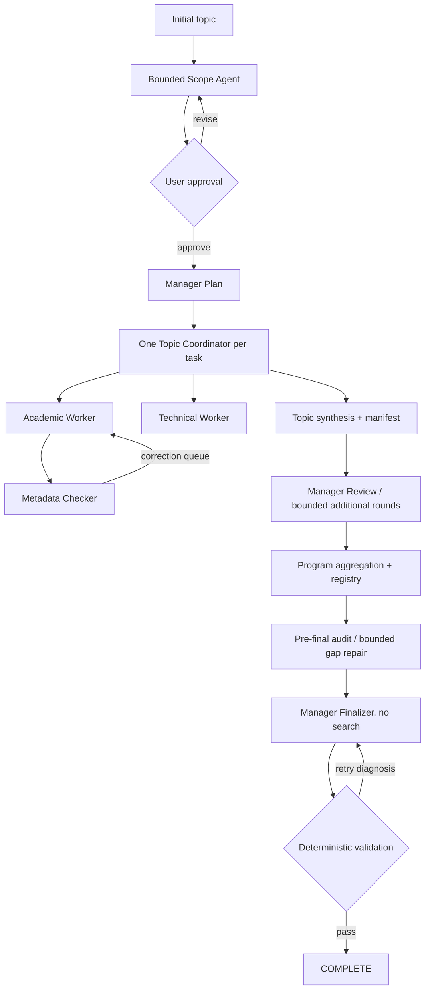

# SLRHarness v1 architecture

## Scope-driven research-line layer

The approved scope remains the source of grouping and ordering truth:

```text
SCOPE.md
  -> artifacts/SCOPE_PRIORITIZATION.json (program-derived, rebuildable)
  -> TASKS.md [line=RL-...]
  -> topic synthesis + optional manifest prioritization
  -> SOURCE_REGISTRY.json research_lines
  -> pre-final coverage/evidence audit
  -> final Section 3 grouping, order, and narrative prominence
```

A research line is a method family or coherent technical route. Papers and
technical sources support lines; they are not the primary ranking units.
Comparison dimensions remain per-item facts, while priority factors drive
cross-line synthesis. The default ordinal policy uses Core, Supporting,
Peripheral, and Insufficient Evidence. Numeric and weighted modes are computed
only when the approved contract is operational; missing values remain unranked
and never become zero.

Coordinator assessments are local and optional. Missing tiers, dimensions,
roles, or factor values propagate as warnings rather than topic reruns. Only
missing core evidence can create bounded research repair. Final-report
structural violations retry the Finalizer alone. Emergent lines are marked
`EMERGENT_UNAPPROVED`; they do not silently extend the approved scope.
Contradictory evidence remains visible in Section 4 regardless of narrative
priority.

SLRHarness is not a single Skill because durable lifecycle control, bounded
process execution, validation, concurrency, and recovery must remain
deterministic. Skills and agents supply research judgment; Python owns authority.



The approval gate is program-owned. Agents cannot change state, revision,
execution mode, attempts, budgets, or completion. The Manager plans and reviews;
each Coordinator confines its subagents to one topic artifact tree. Academic and
technical discovery run independently, then metadata checking occurs after paper
notes exist. Direct messaging may improve flow, but the stable
`correction_requests.jsonl` queue is the recovery contract.

The design is artifact-first: process exit success is never sufficient.
Coordinator manifests, indexes, notes, audits, global registry, and the report
must validate. Shared global files are produced only after topic execution by the
single orchestrator. Important JSON and program-written Markdown use atomic
replacement, and `.git/.slrharness.lock` rejects a second writer.

Source aggregation creates stable IDs and preserves duplicate/version aliases.
Pre-final repair reuses the existing Manager and Coordinator path and has a hard
limit. The Finalizer reads explicit persisted paths, has no search responsibility,
and can reach COMPLETE only through final validation.

Resume uses persisted scope state, Git round tags, topic `task.json`, stable gap
IDs, and finalization sub-state. Revalidation reconciles state with artifacts;
data is retained rather than deleted. Missing MCPs degrade to built-in web tools
or explicit limited/no-result artifacts. Legacy worker topics and versionless v1
JSON remain readable with warnings; unknown schema versions are rejected.

## Canonical workspace layout

`SCOPE.md`, `TASKS.md`, and the sole canonical `SUMMARY.md` remain at workspace
root for backward compatibility. Coordinator support lives adjacent to, but is
distinct from, its primary `topics/**.md` synthesis. Global program-owned output
lives under `artifacts/`; Claude assets live under `.claude/`. Manifest and index
paths are always workspace-relative.

## Retrieval degradation matrix

| Role | Preferred | Fallback | Complete outage behavior |
|---|---|---|---|
| Scope Agent | scholarly, arXiv, scholar | WebSearch/WebFetch, optional Tavily | substantive proposal with `[UNVERIFIED]` and limitations |
| Academic Worker | scholarly/arXiv/scholar and citations | WebSearch/WebFetch | limited-access or `NO_RESULTS.md`; empty results are not an empty field |
| Metadata Checker | scholarly/arXiv/scholar | WebSearch/WebFetch | UNRESOLVED/NOT_CHECKED audit and bounded correction queue |
| Technical Worker | optional Tavily | WebSearch/WebFetch | technical no-result record and limitations |
| Coordinator | persisted subagent artifacts | file queue | no search responsibility; PARTIAL if evidence remains |
| Finalizer | registry, notes and audits | limitations disclosure | never searches or adds an unregistered source |
